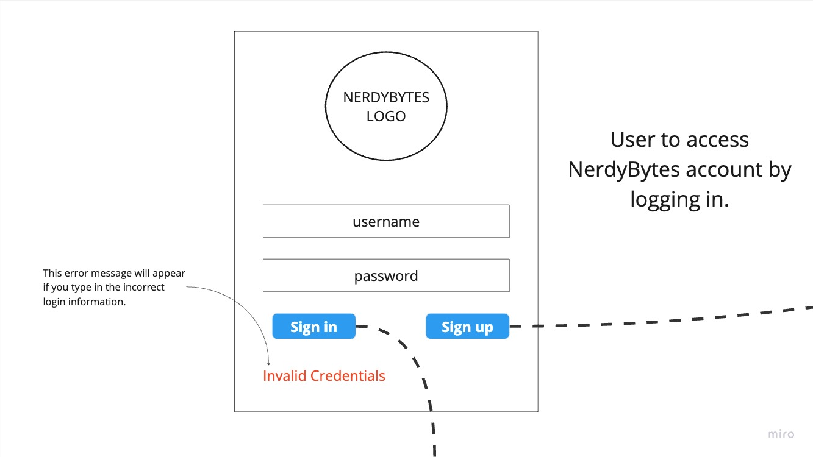
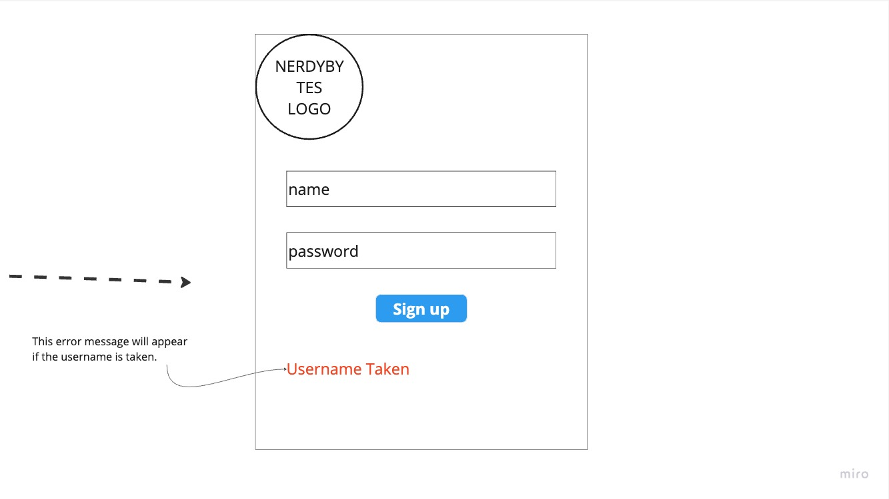
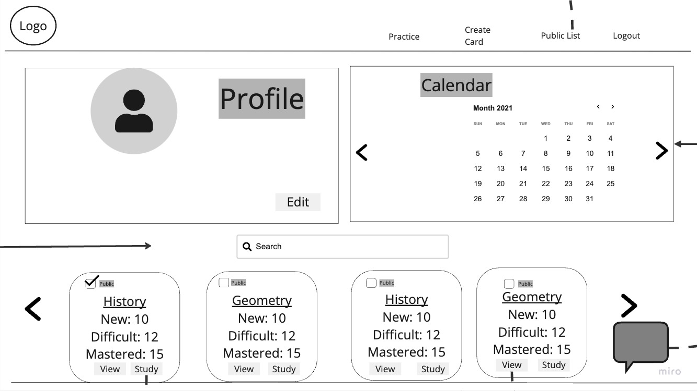
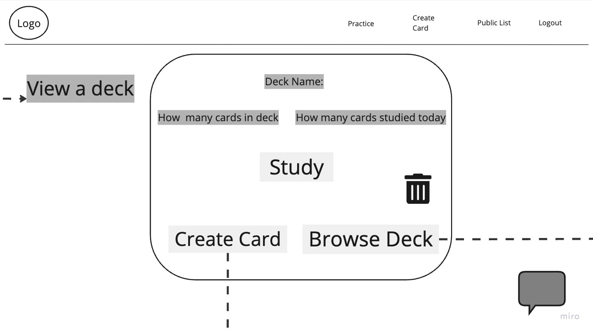
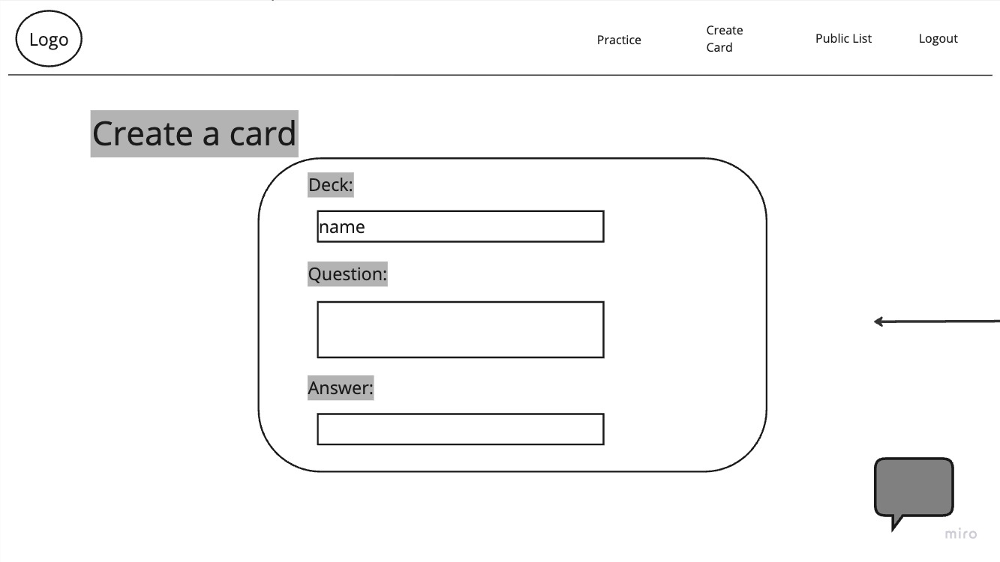
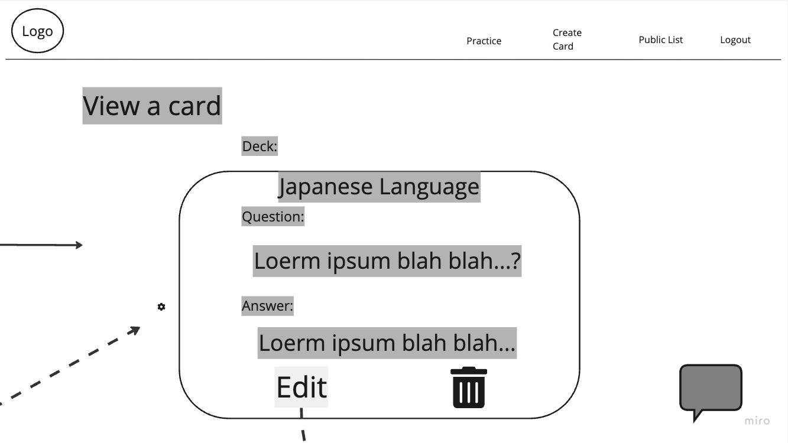
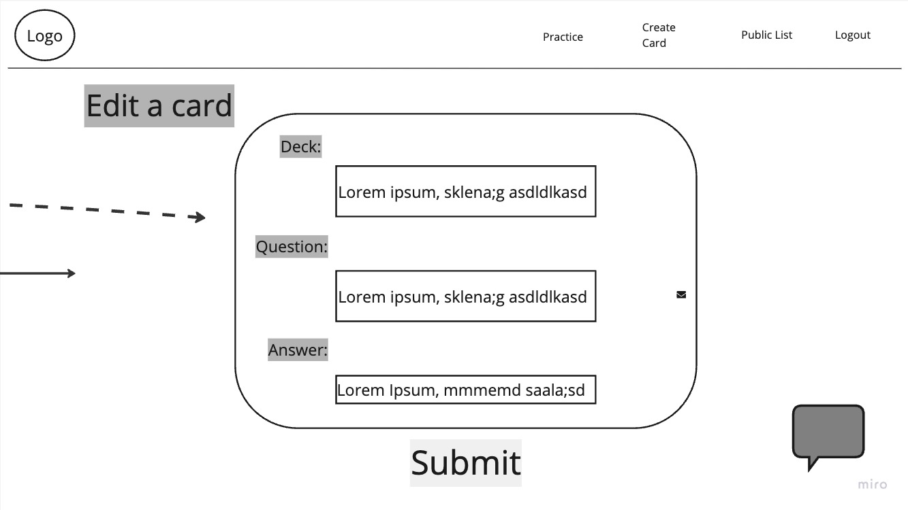
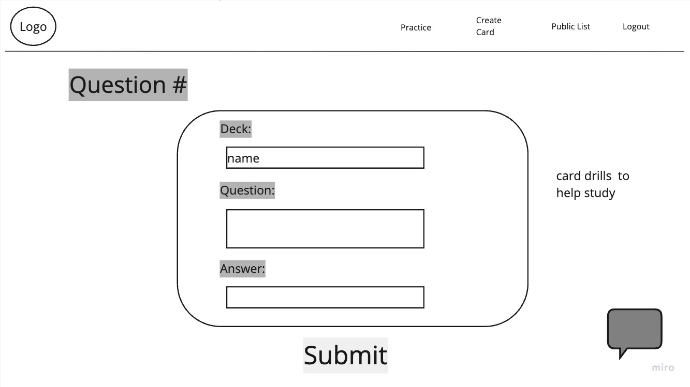
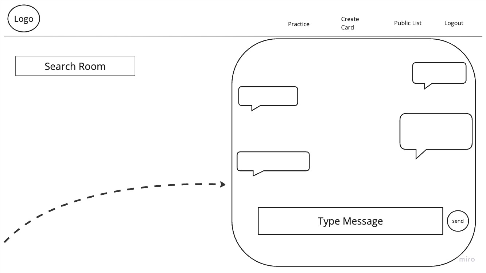
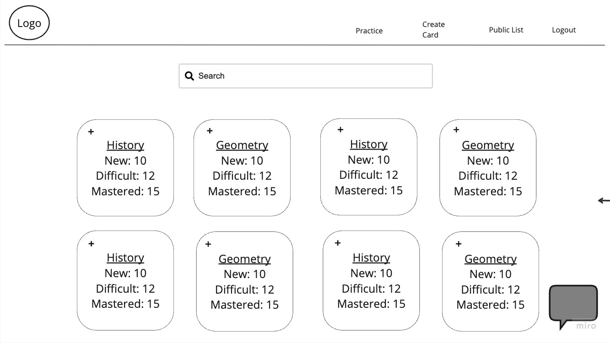

## Customer Graphical Human Interface

### Signin/Signup Page

Signin/Signup view for the user to access the website.

## Dashboard

This is the first page a user will see after signing in. The user will have an access to all it's created deck and a calendar to see the streak on the days they studied.

## Deck Page

Users can click on any deck in their dashboard and will be redirected to this page for the user to browse and view the cards for that specific deck

## Card Page

Users can create and edit a card for each deck.

## Study Page

Users can study each deck and will be redirected to this page and answer a random card.

## Chat Window

Users can chat other users who are in the same study room to collaborate/study together.

## Public View

Users can see a list of all the public decks in the website.

